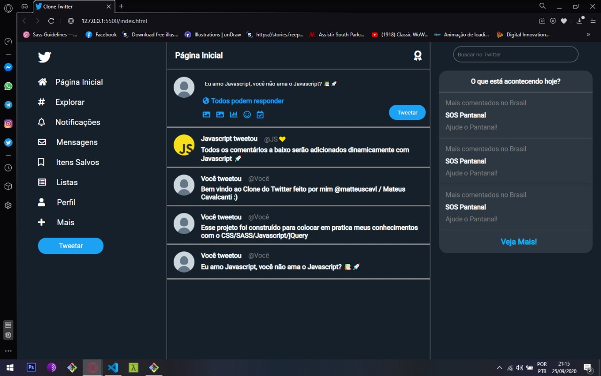
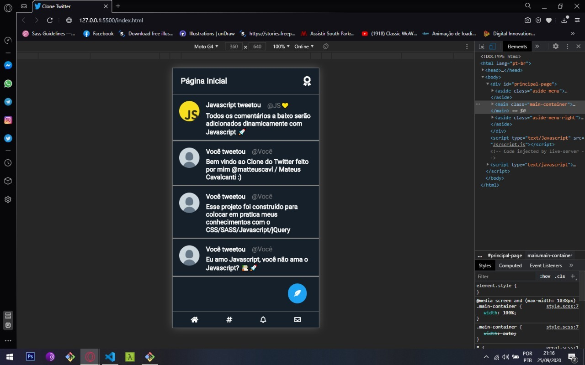

### 📷 Um pouco de como ele ficou:

### 🚀 Tecnologias: 
#### Esse projeto foi construído usando HTML5, CSS3, SASS, Javascript e jQuery. 

### 👨🏻‍💻 Sobre esse projeto:
#### Esse projeto foi construido para colocar em pratica meus conhecimentos de HTML5/CSS3, SASS e JS/jQuery. servindo também para ajudar no aprimoramento da minha lógica com o Javascript.

### 📚 Você quer contribuir com esse projeto? Eu ficaria muito agradecido! 
#### Caso você queria contribuir com esse projeto, você precisa fazer um fork nele com as suas alterações e depois me enviar a solicitação :)